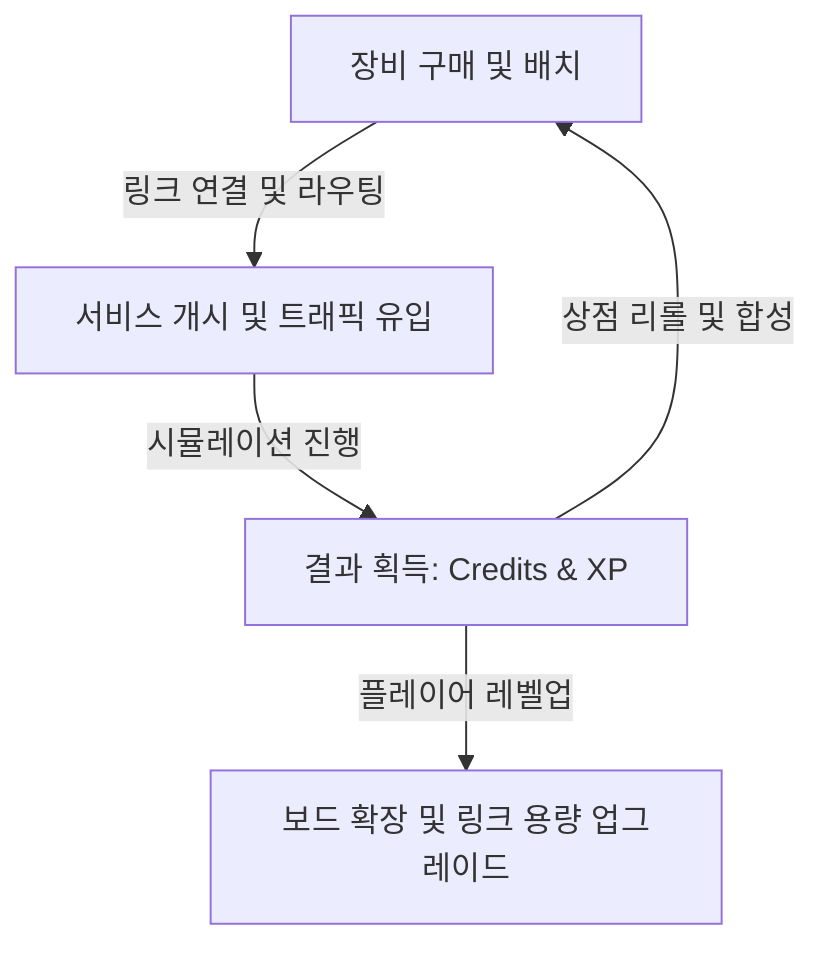

# 기획서: STACK//BREACH (서버 인프라 아키텍처 디펜스)

본 문서는 기말고사 프로젝트 제출을 위해 제작된 **STACK//BREACH** 게임의 공식 기획서입니다.

---

## 1. 게임 소개

* **게임 제목**: STACK//BREACH (스택 브리치)
* **게임 장르**: 서버 인프라 아키텍처 디펜스 / 퍼즐 시뮬레이터
* **플랫폼**: Web (PC 브라우저 환경에 최적화)
* **타깃 유저**:
  - 소프트웨어 공학, 네트워크, 클라우드 인프라 아키텍처를 학습 중인 학생 및 백엔드 지망 개발자
  - 시스템 설계 및 자원 최적화 요소를 선호하는 디펜스/퍼즐 게임 매니아
* **핵심 재미 (Core Fun)**:
  - 직접 서버와 데이터베이스를 연결하고 유입되는 트래픽의 병목 현상(대기큐 폭발, 쿼리 타임아웃 등)을 해결하며 느끼는 시스템 엔지니어링의 쾌감
  - 제한된 예산과 보드 크기 속에서 효율적인 네트워크 경로(Manhattan Distance)를 구상하는 전략성
  - 동일 장비 3개를 모아 합성하고 특색 있는 성능 증강(Augment)을 조합해 자신만의 아키텍처를 육성하는 오토배틀러식 성장 재미
* **참고 레퍼런스 게임**:
  - *Turing Complete*, *Silicon Zeroes* (하드웨어/네트워크 퍼즐 장르의 논리적 아키텍처 빌딩)
  - 일반적인 오토배틀러 상점 및 합성 시스템 (*Dota Underlords*, *Teamfight Tactics*)

---

## 2. 코어 루프 (Core Loop)

1. **행동 (Action)**: 상점에서 인프라 장비(`EC2`, `RDS`, `ALB` 등)를 구매하여 인벤토리에 보관한 뒤, 격자 보드에 배치하고 장비 간에 연결선(트래픽/데이터 링크)을 직접 구성합니다.
2. **보상 (Reward)**: 시뮬레이션(웨이브)이 진행되는 동안 클라이언트의 요청이 지연 없이 성공적으로 처리되면 `Credits`(재화)와 `XP`(경험치)를 획득합니다.
3. **성장 (Growth)**: 획득한 `Credits`로 상점을 새로고침하거나 경험치(XP)를 구매하여 레벨업합니다. 동일 장비를 3개 모아 자동으로 등급을 업그레이드하고 특수 증강을 선택하거나, 레벨업 보상으로 보드 크기를 확장하고 링크 총길이 제한을 늘립니다.
4. **반복 플레이 (Retention)**: 다음 웨이브에 유입되는 더 복잡하고 강력한 병목 패턴(POST 집중, SLOW 쿼리 유발, 순간적인 Burst 트래픽)에 대응하기 위해 아키텍처를 유기적으로 리팩토링합니다.

---

## 3. 세계관 소개

* **게임 배경**:
  - 클라우드 인프라 아키텍트가 되어 가상의 IT 기업의 백엔드 시스템을 총괄 관리하는 가상현실 대시보드 화면.
* **게임 분위기 (Tone & Mood)**:
  - 짙은 프레임과 다크 블루 톤의 프리미엄 테크니컬 디자인.
  - 실시간으로 쏟아지는 트래픽 패킷(광점)과 서버 장비의 실시간 대기열 게이지 상승, 부하 발생 시의 붉은 경고 비주얼을 통해 느껴지는 지적 긴장감.
* **플레이어의 목표**:
  - 총 10개의 서비스 웨이브가 진행되는 동안, 클라이언트의 서비스 요청 중 실패(Timeout, Queue Full) 비율을 낮추어 **Service HP가 0이 되지 않도록 방어하고 최종 스테이지를 클리어**하는 것입니다.
* **상황 설정**:
  - 플레이어가 담당하는 신규 서비스가 런칭된 직후, 예상치 못한 대규모 마케팅 성공 및 이벤트로 인해 사용자 트래픽이 폭발적으로 늘어나는 상황입니다.
* **공간의 특징**:
  - 네트워크 기기들이 배치되는 그리드(격자) 형태의 대시보드 보드판. 플레이어의 레벨에 따라 7×4에서 시작하여 최대 13×6까지 점진적으로 물리적 인프라 영역이 확장됩니다.

---

## 4. 캐릭터 소개

| 구분 | 대상 | 특징 및 역할 |
|:---|:---|:---|
| **주인공** | **인프라 아키텍트 (플레이어)** | 시스템 엔지니어로서 상점의 재화를 분배하고 장비를 최적의 그리드에 스냅하여 네트워크 망을 가설합니다. |
| **적 캐릭터** | **GET 요청 (트래픽)** | DB 읽기 병목을 주로 일으키는 읽기 전용 패킷입니다. |
| **적 캐릭터** | **POST 요청 (트래픽)** | DB 쓰기 병목을 주로 일으키는 쓰기 전용 패킷으로, Primary DB의 성능에 크게 좌우됩니다. |
| **적 캐릭터** | **SLOW 요청 (트래픽)** | 인덱스 처리가 되어 있지 않은 장시간 쿼리를 유도하여 DB Queue를 마비시키는 무거운 패킷입니다. |
| **적 캐릭터** | **Burst 요청 (트래픽)** | 짧은 간격으로 떼를 지어 몰려와 서버 큐를 순식간에 폭발시키는 대량의 패킷 묶음입니다. |
| **보스** | **부하 테스트 (Wave 10)** | 서비스 오픈 최종 단계로, GET, POST, SLOW, Burst가 복합적으로 몰려와 아키텍처의 한계를 시험합니다. |

---

## 5. 컨셉 아트 (Concept Art)

* **비주얼 컨셉**: 밝고 경쾌한 플랫 카드 UI와 다크 네이비의 메인 월드가 대비되는 네오 브루탈리즘 감성의 개발 대시보드 스타일.
* **색상 팔레트 (Color Palette)**:
  - **배경 (World Background)**: 다크 네이비 테마 (`#142238`)
  - **요청 링크 (Traffic Request)**: 파스텔 블루 (`#88b8ef`)
  - **응답 링크 (Traffic Response)**: 파스텔 퍼플 (`#b4a1e5`)
  - **데이터 링크 (DB Connection)**: 소프트 옐로우 (`#f6d477`)
  - **경고 / 실패**: 라이트 레드 (`#e86d7e`)
  - **성공 / 정상**: 라이트 그린 (`#79cf94`)
* **인터페이스 아이콘**: 
  - 각 서버, 로드밸런서, 데이터베이스 기기는 가시성이 높은 단순하고 모던한 SVG 기반 플랫 아이콘으로 표현됩니다.
